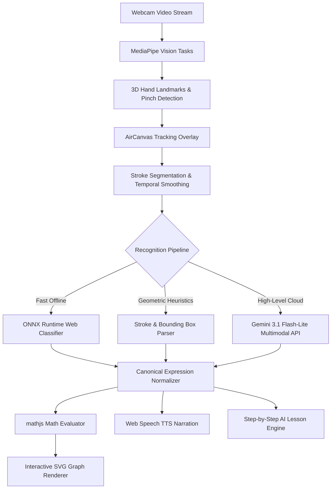

<<<<<<< HEAD
# ♿ Sign2Graph — AI-Powered Spatial Accessibility Assistant for STEM

> **Track PH-09 | AI-Powered Accessibility Assistant**  
> **Theme:** Accessibility | Artificial Intelligence | Assistive Technology | Inclusion  
> **Problem:** People with physical, motor, visual, or neurodivergent accessibility needs face extreme barriers when accessing complex digital information and interactive STEM learning tools.  
> **Challenge:** Develop an inclusive technology solution that improves access to educational, public-service, or everyday digital information for people with disabilities.

---
=======
# PlotlyX

PlotlyX is a web-based AI and computer-vision learning tool that turns an
air-written mathematical or scientific expression into either an interactive
graph or a structured formula lesson.

# PlotlyX System Architecture

PlotlyX is an intelligent air-canvas math recognition and graphing platform combining real-time computer vision, hybrid machine learning, symbolic math evaluation, and responsive reactive visualization.



## 1. Vision & Gesture Tracking Pipeline

- **Engine**: `@mediapipe/tasks-vision` Running in-browser via WebAssembly / WebGL.
- **Landmark Extraction**: 21 3D spatial hand landmarks per frame at 60 FPS.
- **State Machine**:
  - `Hover / Navigate`: Open palm or pointing without pinch tension.
  - `Air Drawing`: Index fingertip tracked with exponential moving average (EMA) smoothing $(\alpha = 0.65)$.
  - `Stroke Segmentation`: Temporal timeout $(450\text{ms})$ and spatial clustering grouping disjoint strokes (e.g. $+$, $=$, $\times$, fractions).

## 2. Hybrid Math Recognition

1. **Geometric Tokenizer (`lib/recognition.ts`)**: Instant bounding-box heuristics, closed-loop detection, and vertical/horizontal stroke aspect ratios.
2. **Personalized Template Matcher (`lib/personalization.ts`)**: Dynamic Time Warping (DTW) feature distance matching against user-specific handwriting profiles.
3. **ONNX Symbol Classifier (`lib/onnx-recognizer.ts`)**: Local client-side neural network classifying isolated handwritten symbols.
4. **Cloud Multimodal Fallback (`app/api/recognize`)**: Gemini 3.1 Flash-Lite vision endpoint parsing complex multi-line calculus, integrals, and physics equations.

## 3. Symbolic Math & Graph Rendering

- **Math Engine**: `mathjs` compiles expressions into native executable JavaScript bytecode.
- **Adaptive Sampling**: Computes 800+ dynamic points across continuous domains with singularity detection and boundary clamping.
- **Implicit Curve Tracer**: Marching squares grid solver for complex non-function relations (e.g., $x^2 + y^2 = 25$).

## 4. Audio & Accessibility

- **Speech Synthesis**: Web Speech API with SSML math phonetics translation (e.g. `\int` $\to$ "integral", `^2` $\to$ "squared").
- **Real-Time Auditory Feedback**: Interactive slider scrubbing and step-by-step audio narration.
>>>>>>> db6f9dd (chore: rename project from Sign2Graph to PlotlyX and remove redundant documentation files)

## 📖 The Story & Problem Statement

### Meet Alex: The STEM Barrier
Alex is a passionate 15-year-old student who dreams of studying physics and computer science. However, Alex lives with a severe motor disability that makes holding a pencil, typing complex math formulas, or manipulating a mouse exhausting and painful.

While standard screen readers work well for digital text documents, **STEM education—algebra, calculus, geometry, and physics equations—remains a digital brick wall**:
* **Physical Input Barriers**: Typing math LaTeX like `\frac{-b \pm \sqrt{b^2-4ac}}{2a}` requires dozens of complex key strokes and precise mouse clicks.
* **Lack of Multi-Sensory Guidance**: Static textbooks and passive online calculators offer no step-by-step audio narration or spatial visual guidance.
* **Prohibitive Hardware Costs**: Traditional assistive eye-trackers or specialized switch hardware cost thousands of dollars ($1,000+) and are rarely available in public classrooms or low-income schools.

---

## 💡 Our Solution: Sign2Graph

**Sign2Graph** turns any standard webcam into an intelligent, touchless, AI-powered spatial accessibility canvas. Without needing a keyboard, mouse, or expensive hardware, students can:

1. **Draw Math & Physics in Mid-Air**: Use simple, low-effort hand gestures and pinches tracked in 3D by computer vision.
2. **Instant AI Symbol & Equation Recognition**: Custom client-side ONNX neural models and multimodal AI convert hand-drawn air strokes into structured math equations.
3. **Interactive 2D Graph Plotting**: Real-time rendering of functions, parabolas, and implicit curves ($x^2 + y^2 = 25$).
4. **Multi-Sensory Audio-Visual Lessons**: Step-by-step text-to-speech audio narration paired with interactive visual graph morphing.
5. **Contextual YouTube Video Lessons**: Integrated educational video recommendations (Khan Academy, 3Blue1Brown, Organic Chemistry Tutor) embedded right inside the explanation view.

---

## 🌟 Key Accessibility Innovations & Features

| Accessibility Need | **Sign2Graph** Feature | Technical Implementation |
| :--- | :--- | :--- |
| **Motor Disabilities & Fatigue** | **Touchless Air Canvas** | MediaPipe 21-point 3D hand tracking with Exponential Moving Average (EMA) smoothing. Zero mouse clicks needed. |
| **Complex Math Input Barriers** | **AI Gesture & Symbol Classifier** | On-device ONNX Runtime Web model + Gemini Multimodal Vision API for instant LaTeX conversion. |
| **Visual & Learning Impairments** | **Multi-Sensory Audio Narration** | Web Speech API text-to-speech engine with SSML phonetic math translation for step-by-step voice guidance. |
| **Neurodivergent & Visual Learners** | **Curated YouTube Lesson Engine** | Context-aware YouTube video recommendations with in-app embedded video player preview. |
| **Financial & Hardware Barriers** | **100% In-Browser & Local AI** | Runs locally in modern web browsers on standard Chromebooks/laptops with webcams. |

<<<<<<< HEAD
---

## 🛠️ Technology Stack

* **Frontend Framework**: Next.js 15 (App Router), React 19, TypeScript
* **Computer Vision**: `@mediapipe/tasks-vision` (Client-side 60 FPS 3D Hand Tracking)
* **Local Neural Network**: `onnxruntime-web` (In-Browser Symbol Recognition)
* **Cloud AI API**: Gemini Multimodal Vision API (`/api/recognize` and `/api/explore`)
* **Math & Plotting Engine**: `mathjs`, SVG Adaptive Curve Sampler & Marching Squares Grid Solver
* **Voice & Audio**: Web Speech API (`lib/narration.ts`)
* **Styling**: Vanilla CSS3 (Custom Glassmorphism & High-Contrast Inclusive Palette)

---

## 🚀 Quick Start Guide

### Prerequisites
* **Node.js**: v18.0.0 or higher
* **npm**: v9.0.0 or higher
* **Webcam**: Standard laptop/USB webcam

### Local Installation

1. **Clone the repository:**
   ```bash
   git clone https://github.com/Sreeju7733/hackathon.git
   cd hackathon/hackathon
   ```

2. **Install dependencies:**
   ```bash
   npm install
   ```

3. **Configure environment variables:**
   Create a `.env.local` file in the `hackathon/hackathon` directory:
   ```env
   GEMINI_API_KEY=your_gemini_api_key_here
   ```

4. **Run the development server:**
   ```bash
   npm run dev
   ```

5. **Open in Browser:**
   Navigate to [http://localhost:3000](http://localhost:3000) and grant camera permissions when prompted.

---

## 🎙️ 1-Minute Hackathon Pitch Deck Script for Judges

> **Slide 1 (The Hook):** "Meet Alex. Alex loves science but has a motor impairment that makes holding a pencil or typing math formulas painful. For millions of students with disabilities, digital STEM tools are a brick wall."
>
> **Slide 2 (The Problem):** "Standard accessibility tools focus on text documents, leaving complex math equations and graphing inaccessible without expensive $1,000+ specialized hardware."
>
> **Slide 3 (Our Solution):** "Introducing **Sign2Graph**—an AI-powered spatial accessibility assistant. Using just a web camera, students draw math in mid-air using simple hand gestures."
>
> **Slide 4 (The Tech & Impact):** "Our client-side ONNX models convert hand signs into LaTeX, plot interactive graphs, read step-by-step audio explanations aloud, and embed YouTube video lessons. It breaks STEM accessibility barriers for zero cost on any web browser."

---

## 📄 Documentation Links
* [TECHNICAL_DOCS.md](file:///c:/Users/dines/OneDrive/Documents/hackathon/hackathon/TECHNICAL_DOCS.md) — Comprehensive System Architecture, Vision Pipeline, and AI Specs.
* [docs/ARCHITECTURE.md](file:///c:/Users/dines/OneDrive/Documents/hackathon/hackathon/docs/ARCHITECTURE.md) — System Architecture Diagram & Data Flow.
* [docs/GESTURES.md](file:///c:/Users/dines/OneDrive/Documents/hackathon/hackathon/docs/GESTURES.md) — Air Canvas Hand Gesture Guide.
=======
- Next.js 15.3.2, React 19, TypeScript, and client-side state management
- MediaPipe Tasks Vision hand landmarks for webcam tracking
- ONNX Runtime Web and the bundled `public/models/math-symbols.onnx` symbol model
- A geometric stroke recognizer with correction and handwriting-profile learning
- Gemini 3.1 Flash-Lite through server routes for multimodal recognition and
  structured explanation plans
- `mathjs` expression evaluation and sampling for explicit and implicit graphs
- SVG graph rendering, KaTeX equation rendering, browser speech synthesis, and
  local browser storage for sessions and preferences
- Automated tests for gesture stabilization, expression normalization, graph
  sampling, and explanation fallbacks
>>>>>>> db6f9dd (chore: rename project from Sign2Graph to PlotlyX and remove redundant documentation files)
