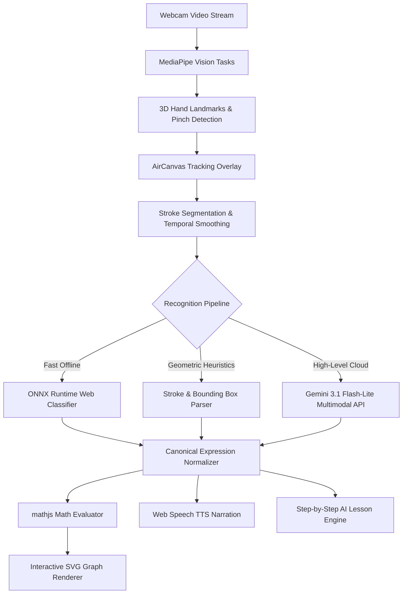

# PlotlyX

PlotlyX is a web-based AI and computer-vision learning tool that turns an
air-written mathematical or scientific expression into either an interactive
graph or a structured formula lesson.

# PlotlyX System Architecture

PlotlyX is an intelligent air-canvas math recognition and graphing platform combining real-time computer vision, hybrid machine learning, symbolic math evaluation, and responsive reactive visualization.

## 1. Vision & Gesture Tracking Pipeline

- **Engine**: `@mediapipe/tasks-vision` Running in-browser via WebAssembly / WebGL.
- **Landmark Extraction**: 21 3D spatial hand landmarks per frame at 60 FPS.
- **State Machine**:
  - `Hover / Navigate`: Open palm or pointing without pinch tension.
  - `Air Drawing`: Index fingertip tracked with exponential moving average (EMA) smoothing $(\alpha = 0.65)$.
  - `Stroke Segmentation`: Temporal timeout $(450\text{ms})$ and spatial clustering grouping disjoint strokes (e.g. $+$, $=$, $\times$, fractions).

## 2. Hybrid Math Recognition

1. **Geometric Tokenizer (`lib/recognition.ts`)**: Instant bounding-box heuristics, closed-loop detection, and vertical/horizontal stroke aspect ratios.
2. **Personalized Template Matcher (`lib/personalization.ts`)**: Dynamic Time Warping (DTW) feature distance matching against user-specific handwriting profiles.
3. **ONNX Symbol Classifier (`lib/onnx-recognizer.ts`)**: Local client-side neural network classifying isolated handwritten symbols.
4. **Cloud Multimodal Fallback (`app/api/recognize`)**: Gemini 3.1 Flash-Lite vision endpoint parsing complex multi-line calculus, integrals, and physics equations.

## 3. Symbolic Math & Graph Rendering

- **Math Engine**: `mathjs` compiles expressions into native executable JavaScript bytecode.
- **Adaptive Sampling**: Computes 800+ dynamic points across continuous domains with singularity detection and boundary clamping.
- **Implicit Curve Tracer**: Marching squares grid solver for complex non-function relations (e.g., $x^2 + y^2 = 25$).

## 4. Audio & Accessibility

- **Speech Synthesis**: Web Speech API with SSML math phonetics translation (e.g. `\int` $\to$ "integral", `^2` $\to$ "squared").
- **Real-Time Auditory Feedback**: Interactive slider scrubbing and step-by-step audio narration.

- Next.js 15.3.2, React 19, TypeScript, and client-side state management
- MediaPipe Tasks Vision hand landmarks for webcam tracking
- ONNX Runtime Web and the bundled `public/models/math-symbols.onnx` symbol model
- A geometric stroke recognizer with correction and handwriting-profile learning
- Gemini 3.1 Flash-Lite through server routes for multimodal recognition and
  structured explanation plans
- `mathjs` expression evaluation and sampling for explicit and implicit graphs
- SVG graph rendering, KaTeX equation rendering, browser speech synthesis, and
  local browser storage for sessions and preferences
- Automated tests for gesture stabilization, expression normalization, graph
  sampling, and explanation fallbacks
