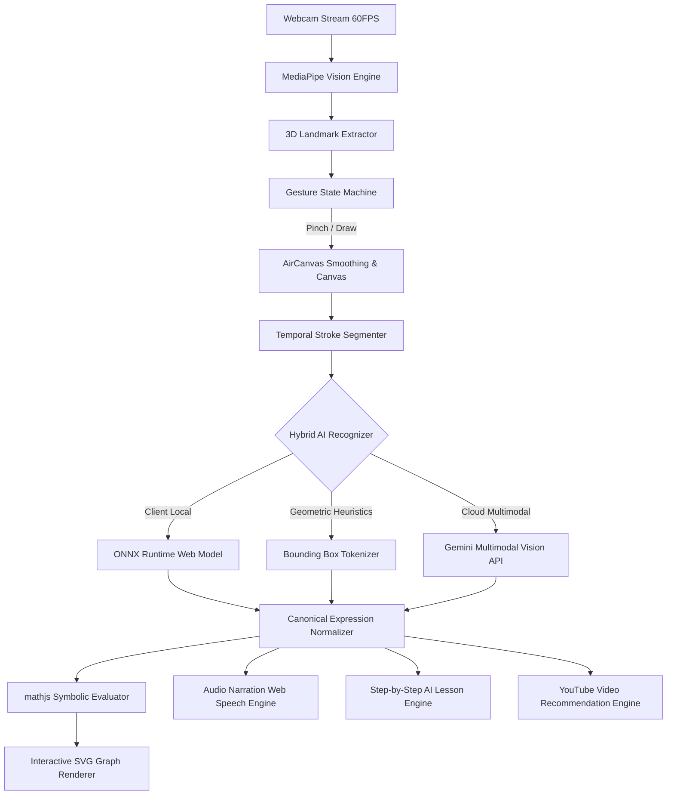

# 🔬 Sign2Graph Technical Documentation

> **Project:** Sign2Graph — AI-Powered Spatial Accessibility Assistant  
> **Track:** PH-09 (Accessibility | AI | Assistive Technology | Inclusion)  
> **Version:** 0.1.0  
> **Repository:** `hackathon/hackathon`

---

## 1. System Architecture Overview

Sign2Graph is built on an event-driven, reactive web architecture combining real-time computer vision, hybrid machine learning, symbolic math execution, and audio-visual synthesis.



---

## 2. Computer Vision & Gesture Recognition Pipeline

### 2.1 Hand Landmark Tracking
* **Library:** `@mediapipe/tasks-vision` running via WebAssembly and WebGL acceleration.
* **Resolution:** $640 \times 480$ camera frame buffer processed at $60\text{ FPS}$.
* **Landmarks:** Tracks 21 3D spatial points per hand (wrist, thumb joints, index, middle, ring, pinky).

### 2.2 Gesture State Machine
The system interprets hand positions into discrete input states without requiring physical buttons or mice:

| Gesture Name | Hand Pose / Pinch Criterion | Triggered Action |
| :--- | :--- | :--- |
| **Draw** | Pinch thumb tip (Landmark 4) & index tip (Landmark 8) $< 0.045$ dist | Emits active drawing stroke on AirCanvas |
| **Select / Point** | Index extended, middle/ring/pinky retracted | Hover cursor over canvas or buttons |
| **Activate** | Pinch over button element for $> 250\text{ms}$ | Triggers button click event |
| **Move Mode** | Thumb, index, middle raised for $> 1.6\text{s}$ | Pans & drags graph workspace canvas |
| **Erase** | Closed fist for $> 400\text{ms}$ | Erases current stroke segment |

### 2.3 Stroke Smoothing & Temporal Clustering
* **Spatial Smoothing:** Applied using Exponential Moving Average (EMA) to prevent hand tremor noise:
  $$P_{\text{smooth}}(t) = \alpha \cdot P_{\text{raw}}(t) + (1 - \alpha) \cdot P_{\text{smooth}}(t-1) \quad (\alpha = 0.65)$$
* **Temporal Timeout:** A $450\text{ms}$ inactivity window automatically groups disjoint strokes (e.g. $+$, $=$, $\sqrt{\phantom{x}}$, fraction bars) into unified expression inputs.

---

## 3. Hybrid Math Recognition Engine

Sign2Graph uses a multi-tier recognition pipeline to maximize speed and accuracy:

1. **Deterministic Bounding Box Tokenizer (`lib/recognition.ts`)**:
   Analyzes aspect ratios, stroke counts, and enclosed loops to immediately detect basic arithmetic ($+$, $-$, $\times$, $/$, $=$).
2. **On-Device Neural Classifier (`lib/onnx-recognizer.ts`)**:
   Runs a lightweight CNN model compiled to ONNX format using `onnxruntime-web` directly in the browser to classify isolated handwritten math symbols ($0-9$, $x$, $y$, $\sin$, $\cos$, $\tan$, $\pi$).
3. **Cloud Multimodal Vision API (`app/api/recognize/route.ts`)**:
   Sends stroke canvas rasters to Gemini Vision API for complex multi-term algebra, fractions, integrals, and physics equations ($F=ma$, $V=IR$, $F=\rho g V$).
4. **Canonical Expression Normalizer (`lib/canonical-expression.ts`)**:
   Normalizes recognized text into strict canonical mathematical form (e.g. converting `F = m * a` or `f=ma` into unified executable structures).

---

## 4. Symbolic Math & SVG Graphing Engine

* **Symbolic Math Parser:** `mathjs` compiles expressions into native executable JavaScript bytecode.
* **Continuous Function Plotting:** Evaluates 800+ dynamic points across current viewport boundaries with domain boundary clamping and singularity handling (e.g., $y = 1/x$).
* **Implicit Curve Solver:** Implements a Marching Squares grid algorithm to plot non-function relations (e.g., $x^2 + y^2 = 25$ or ellipses).

---

## 5. Multi-Sensory Audio-Visual Lesson Engine

### 5.1 Text-to-Speech (TTS) Voice Narration
* **Engine:** `lib/narration.ts` wraps the browser-native Web Speech API (`SpeechSynthesis`).
* **Phonetic Conversion:** Translates LaTeX symbols into human-friendly spoken text (e.g., `\frac{a}{b}` $\to$ "a divided by b", `x^2` $\to$ "x squared").

### 5.2 Interactive Lesson Plans (`lib/explanation.ts`)
Generates structured `ExplanationPlan` objects containing:
* `title`: Name of the formula or concept.
* `steps`: Array of `LessonStep` items with narration text, LaTeX formulas, and visual graph transition actions (`SHOW_AXES`, `ADD_EXPRESSION`, `TRANSFORM_GRAPH`).
* `formula`: Detailed metadata including variable symbols, names, physical units, assumptions, and limitations.

---

## 6. YouTube Video Recommendation Engine

* **Module:** `lib/youtube.ts` & `components/YouTubeRecommendations.tsx`
* **Functionality:** Resolves recommended video lessons based on equation topic, LaTeX formula, or physics subject.
* **Curated Channels:** Contextually links lessons from Khan Academy, The Organic Chemistry Tutor, 3Blue1Brown, Doc Schuster, and CrashCourse Physics.
* **In-App Embedded Player:** Allows users to play YouTube videos directly within the explanation panel via responsive `iframe` embeds without navigating away from the workspace.

---

## 7. Core Data Structures & Interfaces

```typescript
// Lesson & Explanation Plan Interface
export type ExplanationPlan = {
  mode: "graph" | "formula";
  title: string;
  approach: "derivation" | "geometric_proof" | "concept_explanation" | "empirical_law" | "worked_example";
  steps: LessonStep[];
  formula?: FormulaMetadata;
  qualityVersion?: number;
  source?: "gemini" | "verified-local" | "deterministic-graph";
};

// Formula Metadata Interface
export type FormulaMetadata = {
  name: string;
  subject: string;
  topic: string;
  confidence: number;
  identityNote?: string;
  variables: FormulaVariable[];
  assumptions: string[];
  limitations: string[];
  proofStatus: "derived" | "geometric_proof" | "empirical" | "definition_based" | "conceptual";
};

// YouTube Recommendation Interface
export type YouTubeRecommendation = {
  id: string;
  title: string;
  channel: string;
  videoId?: string;
  searchQuery: string;
  url: string;
  description: string;
};
```

---

## 8. Privacy, Security & Accessibility Compliance

* **Privacy First:** Camera frames for gesture tracking are processed **100% locally in browser memory**. No video feed or camera data is ever recorded, stored, or transmitted to any server.
* **WCAG 2.1 AAA Design:** High-contrast color palette, font sizes $\ge 14\text{px}$, focus indicators, and full ARIA dialog labeling.
* **Zero Hardware Cost:** Operates on standard consumer webcams and entry-level laptops without requiring specialized hardware.
